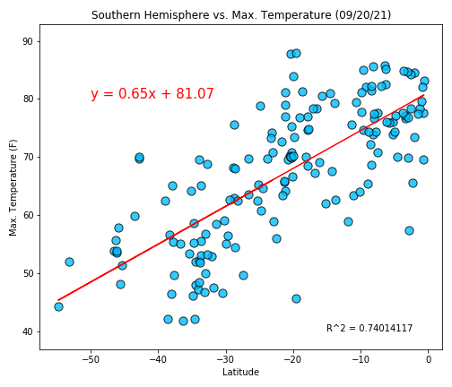
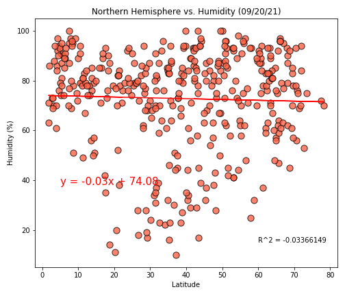
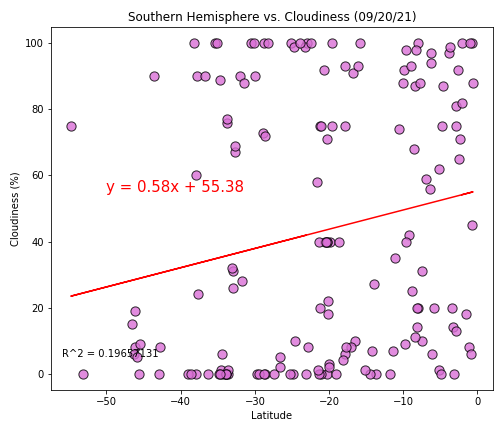

# Background

This project is an assignment hands-on practicing and demonstrating data requests from API, dataset cleaning,  manipulation, and data visualization (geospatial visualization). The analysis includes two parts,  the weather of more than 600 cities worldwide and spatial analysis of selected cities. Jupyter notebook is used for the analysis and could be referred to as below:

[WeatherPy](https://github.com/KeSavanh/python-API-challenge/blob/main/starter_code/WeatherPy.ipynb)
[VacationPy](https://github.com/KeSavanh/python-API-challenge/blob/main/starter_code/VacationPy.ipynb)

# Data processing
List of cities was derived from provided CSV file [`cities.csv`](https://github.com/KeSavanh/python-API-challenge/blob/main/output_data/cities.csv). By using city names from the list to retrieve data from API then stored in a data frame [`CityWeather.csv`](https://github.com/KeSavanh/python-API-challenge/blob/main/output_data/CityWeather.csv). `CityWeather.csv` has columns of `City`, `Country`, `Lat`, `Lng`, `Date`, `Cloudiness`, `Max. Temp.`, `Humidity`, `Wind Speed` that contain values of each city.
Correlation of the latitude, temperature, humidity, percentage of cloud, and wind speed were plotted in scatter plots, and regression analysis was calculated and add to each plot.

# Results
## Part I - WeatherPy

### Observation and insights

1. The relationship plot and regression analysis shows and confirms that temperature decreases moving towards The Northern and Southern Hemisphere from the equator. However, cities with the highest temperatures are located slightly on the north latitude, and this pattern could be related to the elevation of the cities.

2. Humidity is always high in cities near the equator and could partially drop down towards north and south. Since humidity could vary hourly, it would be interesting to compare the pattern to precipitation data.

3. There is no significant correlation between latitude and cloudiness both from scatter plots and regression analysis. However, it could be related to temperature and humidity.

### Northern Hemisphere - Temperature (F) vs. Latitude
   
### Southern Hemisphere - Temperature (F) vs. Latitude
   
### Northern Hemisphere - Humidity (%) vs. Latitude
   
### Southern Hemisphere - Humidity (%) vs. Latitude
   
### Northern Hemisphere - Cloudiness (%) vs. Latitude
   
### Southern Hemisphere - Cloudiness (%) vs. Latitude
   
### Northern Hemisphere - Wind Speed (mph) vs. Latitude
   
### Southern Hemisphere - Wind Speed (mph) vs. Latitude
   

## Part II - VacationPy
From `CityWeather.csv` , humidity of all cities were displayed on a map using `gmaps` plot. Hotel locations were retrives from `google place` API by `Lat` and `Lng` of the selected cities. The locations is diplayed on the map by pins with information box.
1. Humidity over entire city 

  

2. Hotel locations from searching by weather conditions
  

